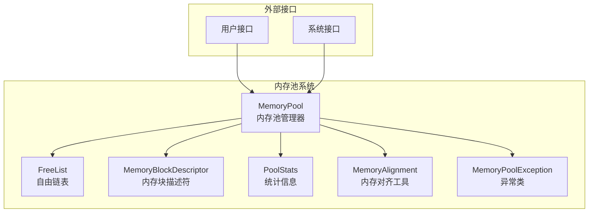
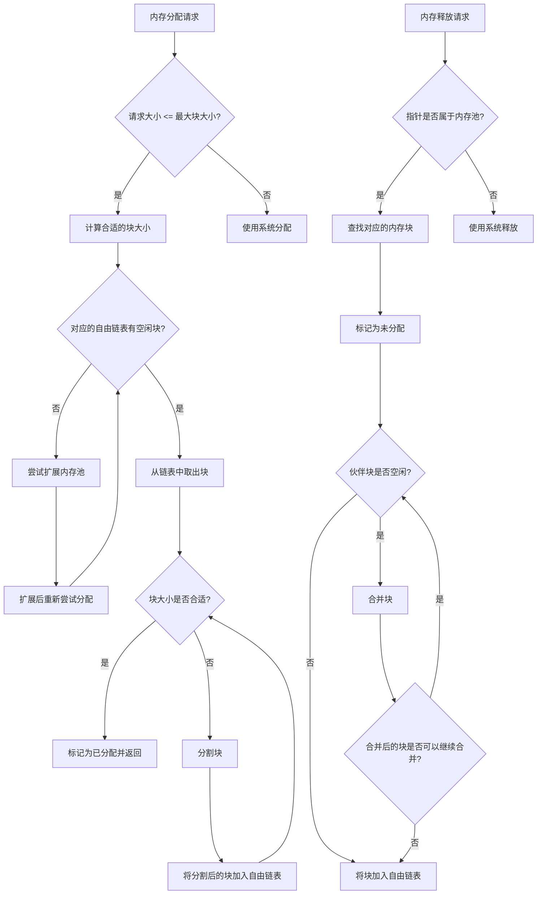
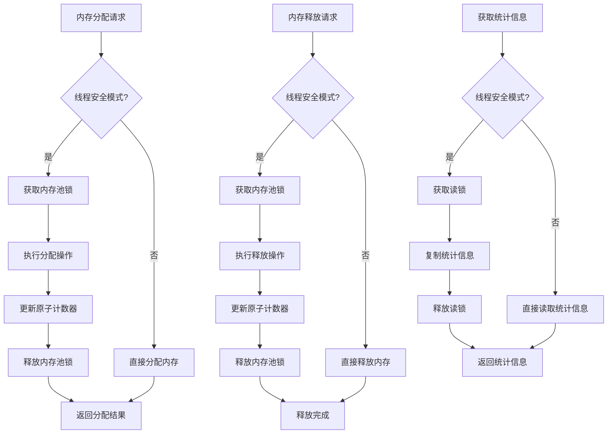
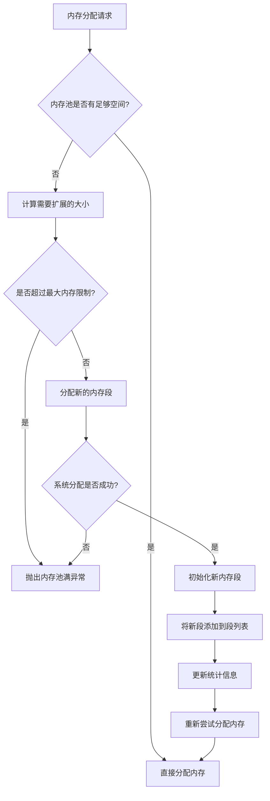
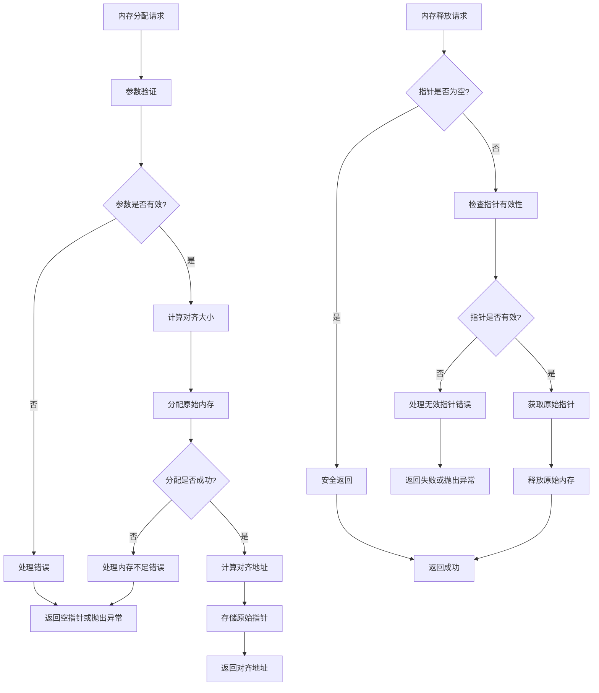
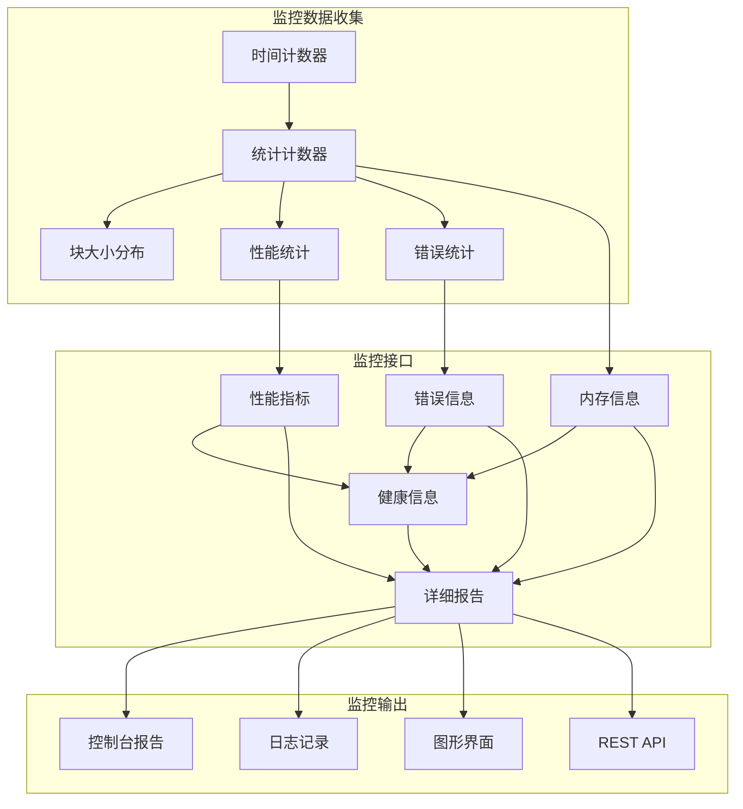

# 高性能内存池设计文档

## 1. 概述

本文档描述了一个高性能内存池的设计方案，该内存池使用伙伴系统（Buddy System）进行内存管理，支持可选的线程安全机制，并具有动态增长策略。设计目标是提供高效的内存分配和释放操作，同时减少内存碎片，适用于高性能计算场景。

### 1.1 设计目标

- **高性能**：优先考虑分配/释放速度，减少内存操作的开销
- **线程安全**：支持多线程环境下的并发内存操作
- **动态扩展**：当内存不足时自动扩展内存池
- **低碎片**：通过伙伴系统有效减少外部内存碎片
- **内存对齐**：支持各种内存对齐要求，优化访问性能
- **监控能力**：提供全面的内存使用统计和性能监控

### 1.2 适用场景

- 高性能计算应用
- 游戏开发
- 实时系统
- 频繁分配/释放小块内存的应用
- 需要精确控制内存使用的场景

## 2. 整体架构

### 2.1 系统架构图



### 2.2 核心组件

1. **MemoryPool**：内存池管理器，负责整体内存管理
2. **FreeList**：自由链表，管理不同大小的空闲内存块
3. **MemoryBlockDescriptor**：内存块描述符，记录内存块的状态和属性
4. **PoolStats**：统计信息，记录内存池的使用情况
5. **MemoryAlignment**：内存对齐工具，提供对齐相关的功能
6. **MemoryPoolException**：异常类，处理各种错误情况

## 3. 核心数据结构

### 3.1 MemoryPool类

```cpp
class MemoryPool {
private:
    // 基本配置
    void* pool_base;                    // 内存池基地址
    size_t pool_size;                   // 内存池大小
    size_t min_block_size;              // 最小块大小
    size_t max_block_size;              // 最大块大小
    bool thread_safe;                   // 是否启用线程安全
    double growth_factor;               // 增长因子
    
    // 线程安全机制
    mutable std::mutex pool_mutex;      // 互斥锁
    mutable std::shared_mutex stats_mutex; // 读写锁
    std::vector<std::mutex> free_list_mutexes; // 自由链表锁
    std::atomic<size_t> atomic_allocation_count{0}; // 原子分配计数器
    std::atomic<size_t> atomic_deallocation_count{0}; // 原子释放计数器
    
    // 内存管理
    FreeList* free_lists;               // 自由链表数组
    size_t free_list_count;             // 自由链表数量
    std::vector<MemorySegment> memory_segments; // 内存段列表
    
    // 统计信息
    mutable PoolStats stats;            // 统计信息
    
    // 错误处理
    ErrorHandlingStrategy error_strategy; // 错误处理策略
    std::function<void(const std::string&)> error_logger; // 错误日志回调
    
public:
    // 构造函数和析构函数
    MemoryPool(size_t initial_size = 1024 * 1024, 
               size_t min_block_size = 16, 
               size_t max_block_size = 1024 * 1024, 
               bool thread_safe = true, 
               double growth_factor = 2.0);
    ~MemoryPool();
    
    // 内存分配和释放
    void* allocate(size_t size, size_t alignment = DEFAULT_ALIGNMENT);
    template<typename T> T* allocate_type(size_t count = 1);
    void deallocate(void* ptr);
    void* safe_allocate(size_t size, size_t alignment = DEFAULT_ALIGNMENT);
    bool safe_deallocate(void* ptr);
    
    // 内存池管理
    void reset();
    bool is_valid_pointer(void* ptr) const;
    size_t get_block_size(void* ptr) const;
    
    // 线程安全控制
    void set_thread_safe(bool enabled);
    bool is_thread_safe() const;
    
    // 统计和监控
    PoolStats get_stats() const;
    MemoryUsage get_memory_usage() const;
    PerformanceMetrics get_performance_metrics() const;
    ErrorStats get_error_stats() const;
    HealthReport get_health_report() const;
    std::string get_detailed_report() const;
    void reset_stats();
    
    // 错误处理
    void set_error_handling_strategy(ErrorHandlingStrategy strategy);
    void set_error_logger(std::function<void(const std::string&)> logger);
    
private:
    // 内部实现方法
    void* allocate_from_pool(size_t size);
    void expand_pool(size_t required_size);
    void split_block(MemoryBlockDescriptor* block);
    void merge_blocks(MemoryBlockDescriptor* block);
    MemoryBlockDescriptor* find_buddy(MemoryBlockDescriptor* block);
    size_t calculate_block_size(size_t requested_size);
    void initialize_free_lists();
    void add_memory_segment(void* base, size_t size);
    void release_all_segments();
    void* allocate_aligned(size_t size, size_t alignment);
    void deallocate_aligned(void* ptr);
    void handle_error(const std::string& error_msg, ErrorType error_type);
    void update_block_size_distribution(size_t size);
};
```

### 3.2 FreeList类

```cpp
class FreeList {
private:
    size_t block_size;                 // 内存块大小
    MemoryBlockDescriptor* head;      // 链表头
    size_t block_count;                // 内存块数量
    std::mutex list_mutex;             // 链表锁
    
public:
    FreeList(size_t block_size);
    ~FreeList();
    
    // 链表操作
    void push(MemoryBlockDescriptor* block);
    MemoryBlockDescriptor* pop();
    bool is_empty() const;
    bool remove(MemoryBlockDescriptor* block);
    void clear();
    
    // 查询方法
    size_t get_block_size() const;
    size_t get_block_count() const;
    MemoryBlockDescriptor* get_head() const;
    void set_head(MemoryBlockDescriptor* head);
};
```

### 3.3 MemoryBlockDescriptor类

```cpp
class MemoryBlockDescriptor {
private:
    void* address;                     // 内存块地址
    size_t size;                       // 内存块大小
    bool allocated;                    // 是否已分配
    MemoryBlockDescriptor* next;       // 下一个块（用于链表）
    
public:
    MemoryBlockDescriptor(void* addr, size_t sz, bool allocated = false);
    
    // 基本属性
    void* get_address() const;
    size_t get_size() const;
    bool is_allocated() const;
    void set_allocated(bool allocated);
    
    // 链表操作
    MemoryBlockDescriptor* get_next() const;
    void set_next(MemoryBlockDescriptor* next);
    
    // 伙伴系统
    void* calculate_buddy_address() const;
};
```

### 3.4 PoolStats类

```cpp
class PoolStats {
private:
    // 基本统计
    size_t total_memory;          // 总内存大小
    size_t used_memory;           // 已使用内存大小
    size_t free_memory;           // 空闲内存大小
    size_t allocation_count;      // 分配次数
    size_t deallocation_count;    // 释放次数
    size_t fragment_count;        // 碎片数量
    
    // 性能统计
    std::chrono::nanoseconds total_alloc_time;  // 总分配时间
    std::chrono::nanoseconds total_dealloc_time; // 总释放时间
    size_t max_alloc_time;        // 最大单次分配时间
    size_t max_dealloc_time;      // 最大单次释放时间
    
    // 历史统计
    size_t peak_memory_usage;     // 峰值内存使用量
    size_t peak_allocation_count; // 峰值分配次数
    std::chrono::system_clock::time_point creation_time; // 创建时间
    std::chrono::system_clock::time_point last_access_time; // 最后访问时间
    
    // 错误统计
    size_t allocation_failures;   // 分配失败次数
    size_t deallocation_failures; // 释放失败次数
    size_t invalid_pointer_errors; // 无效指针错误次数
    
    // 块大小分布
    std::map<size_t, size_t> block_size_distribution; // 块大小分布
    
public:
    PoolStats();
    
    // 基本统计方法
    size_t get_total_memory() const;
    size_t get_used_memory() const;
    size_t get_free_memory() const;
    size_t get_allocation_count() const;
    size_t get_deallocation_count() const;
    size_t get_fragment_count() const;
    
    // 性能统计方法
    std::chrono::nanoseconds get_total_alloc_time() const;
    std::chrono::nanoseconds get_total_dealloc_time() const;
    size_t get_max_alloc_time() const;
    size_t get_max_dealloc_time() const;
    double get_average_alloc_time() const;
    double get_average_dealloc_time() const;
    
    // 历史统计方法
    size_t get_peak_memory_usage() const;
    size_t get_peak_allocation_count() const;
    std::chrono::system_clock::time_point get_creation_time() const;
    std::chrono::system_clock::time_point get_last_access_time() const;
    std::chrono::duration<double> get_uptime() const;
    
    // 错误统计方法
    size_t get_allocation_failures() const;
    size_t get_deallocation_failures() const;
    size_t get_invalid_pointer_errors() const;
    double get_allocation_failure_rate() const;
    double get_deallocation_failure_rate() const;
    
    // 块大小分布
    const std::map<size_t, size_t>& get_block_size_distribution() const;
    
    // 使用率和碎片率
    double get_memory_usage() const;
    double get_fragmentation_rate() const;
    
    // 重置和摘要
    void reset();
    std::string get_summary() const;
};
```

## 4. 伙伴系统设计

### 4.1 伙伴系统原理

伙伴系统是一种高效的内存管理算法，其核心特点：

1. **内存块大小**：所有内存块的大小都是2的幂次方（如16、32、64、128...字节）
2. **伙伴关系**：每个内存块都有一个"伙伴"，它们大小相同且相邻
3. **分割与合并**：大块可以分割成两个"伙伴"块，小块可以合并成一个大块

### 4.2 内存块分割算法

```cpp
void MemoryPool::split_block(MemoryBlockDescriptor* block) {
    // 检查块是否可以分割（必须大于最小块大小且未分配）
    if (block->get_size() <= min_block_size || block->is_allocated()) {
        return;
    }

    // 计算分割后的大小
    size_t new_size = block->get_size() / 2;
    
    // 创建第一个子块
    void* first_addr = block->get_address();
    MemoryBlockDescriptor* first_block = new MemoryBlockDescriptor(first_addr, new_size, false);
    
    // 创建第二个子块（伙伴块）
    void* second_addr = static_cast<char*>(first_addr) + new_size;
    MemoryBlockDescriptor* second_block = new MemoryBlockDescriptor(second_addr, new_size, false);
    
    // 将子块添加到对应的自由链表
    size_t list_index = log2(new_size) - log2(min_block_size);
    free_lists[list_index].push(first_block);
    free_lists[list_index].push(second_block);
    
    // 更新统计信息
    stats.fragment_count++;
}
```

### 4.3 内存块合并算法

```cpp
void MemoryPool::merge_blocks(MemoryBlockDescriptor* block) {
    if (block->is_allocated()) {
        return; // 已分配的块不能合并
    }

    // 查找伙伴块
    MemoryBlockDescriptor* buddy = find_buddy(block);
    
    // 检查伙伴块是否存在且空闲
    if (buddy && !buddy->is_allocated() && buddy->get_size() == block->get_size()) {
        // 从自由链表中移除伙伴块
        size_t list_index = log2(block->get_size()) - log2(min_block_size);
        free_lists[list_index].remove(buddy);
        
        // 创建新的合并块
        void* new_addr = std::min(block->get_address(), buddy->get_address());
        size_t new_size = block->get_size() * 2;
        MemoryBlockDescriptor* merged_block = new MemoryBlockDescriptor(new_addr, new_size, false);
        
        // 将合并块添加到对应的自由链表
        size_t new_list_index = log2(new_size) - log2(min_block_size);
        if (new_list_index < free_list_count) {
            free_lists[new_list_index].push(merged_block);
        }
        
        // 释放原来的块描述符
        delete block;
        delete buddy;
        
        // 更新统计信息
        stats.fragment_count--;
        
        // 递归尝试继续合并
        merge_blocks(merged_block);
    }
}
```

### 4.4 伙伴系统流程图



## 5. 线程安全机制

### 5.1 线程安全策略

内存池的线程安全机制设计遵循以下策略：

1. **可选性**：用户可以通过构造函数参数或运行时方法启用/禁用线程安全
2. **细粒度锁**：对不同操作使用不同级别的锁，减少锁竞争
3. **性能优化**：在单线程场景下，禁用线程安全以获得最佳性能
4. **异常安全**：确保在异常情况下锁能正确释放

### 5.2 锁机制设计

```cpp
class MemoryPool {
private:
    // 互斥锁保护整个内存池操作
    mutable std::mutex pool_mutex;
    
    // 读写锁，用于统计信息的读取（允许多个线程同时读取）
    mutable std::shared_mutex stats_mutex;
    
    // 细粒度锁，每个自由链表一个锁，减少锁竞争
    std::vector<std::mutex> free_list_mutexes;
    
    // 原子操作计数器，用于快速统计更新
    std::atomic<size_t> atomic_allocation_count{0};
    std::atomic<size_t> atomic_deallocation_count{0};
    
    // 锁管理辅助类，确保异常安全
    class ScopedLock {
    private:
        std::mutex& mutex;
        bool locked;
        
    public:
        explicit ScopedLock(std::mutex& m) : mutex(m), locked(true) {
            mutex.lock();
        }
        
        ~ScopedLock() {
            if (locked) {
                mutex.unlock();
            }
        }
        
        void unlock() {
            if (locked) {
                mutex.unlock();
                locked = false;
            }
        }
    };
};
```

### 5.3 线程安全的内存分配

```cpp
void* MemoryPool::allocate(size_t size) {
    if (thread_safe) {
        // 使用细粒度锁：先获取整个池的锁
        ScopedLock pool_lock(pool_mutex);
        
        try {
            void* result = allocate_from_pool(size);
            
            // 使用原子操作更新计数器
            atomic_allocation_count.fetch_add(1, std::memory_order_relaxed);
            
            return result;
        } catch (...) {
            // 确保异常情况下锁能正确释放
            throw;
        }
    } else {
        // 单线程模式，无需加锁
        return allocate_from_pool(size);
    }
}
```

### 5.4 线程安全机制流程图



## 6. 动态增长策略

### 6.1 动态增长策略概述

内存池的动态增长策略设计遵循以下原则：

1. **按需扩展**：当内存池无法满足分配请求时，自动扩展内存池
2. **指数增长**：每次扩展按当前大小的一定比例（如2倍）增长，减少频繁扩展
3. **内存对齐**：确保新分配的内存满足系统对齐要求
4. **段管理**：维护多个内存段的列表，便于统一管理和释放
5. **性能优化**：扩展操作尽可能高效，减少对正常分配/释放的影响

### 6.2 内存池扩展算法

```cpp
void MemoryPool::expand_pool(size_t required_size) {
    // 计算需要扩展的大小
    size_t expand_size = calculate_expand_size(required_size);
    
    // 检查是否超过最大内存限制
    if (max_memory_limit > 0 && total_memory_size + expand_size > max_memory_limit) {
        throw PoolFullException("Memory pool has reached maximum size limit");
    }
    
    // 分配新的内存段
    void* new_segment = allocate_system_memory(expand_size);
    
    if (!new_segment) {
        throw OutOfMemoryException("Failed to allocate system memory for pool expansion");
    }
    
    // 添加到内存段列表
    {
        std::lock_guard<std::mutex> lock(pool_mutex);
        memory_segments.emplace_back(new_segment, expand_size, true);
        total_memory_size += expand_size;
        
        // 初始化新段的自由链表
        initialize_segment(new_segment, expand_size);
        
        // 更新统计信息
        stats.total_memory = total_memory_size;
        stats.free_memory += expand_size;
    }
}
```

### 6.3 动态增长策略流程图



## 7. 内存对齐和错误处理

### 7.1 内存对齐策略

内存对齐是内存池设计中的重要考虑因素，它影响内存访问的性能和正确性：

1. **平台相关**：不同平台有不同的对齐要求（如32位系统通常4字节对齐，64位系统通常8字节对齐）
2. **性能优化**：正确对齐的内存访问可以提高性能，特别是在SIMD操作中
3. **硬件要求**：某些硬件指令要求特定的对齐方式
4. **类型安全**：确保为不同数据类型提供适当对齐的内存

### 7.2 内存对齐工具类

```cpp
class MemoryAlignment {
public:
    // 获取系统的默认对齐大小
    static size_t get_system_alignment() {
        return alignof(std::max_align_t);
    }
    
    // 获取指定类型的对齐要求
    template<typename T>
    static size_t get_type_alignment() {
        return alignof(T);
    }
    
    // 计算向上对齐的大小
    static size_t align_up(size_t size, size_t alignment) {
        if (alignment == 0) {
            return size;
        }
        return (size + alignment - 1) & ~(alignment - 1);
    }
    
    // 计算向下对齐的大小
    static size_t align_down(size_t size, size_t alignment) {
        if (alignment == 0) {
            return size;
        }
        return size & ~(alignment - 1);
    }
    
    // 检查地址是否对齐
    static bool is_aligned(void* ptr, size_t alignment) {
        return reinterpret_cast<uintptr_t>(ptr) % alignment == 0;
    }
    
    // 获取下一个对齐地址
    static void* get_aligned_address(void* ptr, size_t alignment) {
        uintptr_t addr = reinterpret_cast<uintptr_t>(ptr);
        uintptr_t aligned_addr = align_up(addr, alignment);
        return reinterpret_cast<void*>(aligned_addr);
    }
    
    // 获取对齐所需的偏移量
    static size_t get_alignment_offset(void* ptr, size_t alignment) {
        uintptr_t addr = reinterpret_cast<uintptr_t>(ptr);
        return (alignment - (addr % alignment)) % alignment;
    }
};
```

### 7.3 错误处理机制

内存池提供了全面的错误处理机制，包括多种异常类型和灵活的错误处理策略：

1. **异常类型**：
   - `OutOfMemoryException`：内存不足异常
   - `InvalidPointerException`：无效指针异常
   - `PoolFullException`：内存池已满异常
   - `InvalidAlignmentException`：无效对齐异常

2. **错误处理策略**：
   - `THROW_EXCEPTION`：抛出异常
   - `RETURN_NULLPTR`：返回空指针
   - `LOG_ERROR`：记录错误日志
   - `TERMINATE`：终止程序

### 7.4 内存对齐和错误处理流程图



## 8. 状态监控接口

### 8.1 监控功能概述

内存池状态监控接口提供以下功能：

1. **实时统计**：获取内存池的当前使用情况
2. **历史记录**：跟踪内存池的使用历史和趋势
3. **性能指标**：监控分配/释放操作的性能
4. **健康检查**：检测内存池的健康状态和潜在问题
5. **调试信息**：提供详细的调试信息，便于问题诊断

### 8.2 监控数据结构

```cpp
// 内存使用情况
struct MemoryUsage {
    size_t total;
    size_t used;
    size_t free;
    double usage_percent;
};

// 性能指标
struct PerformanceMetrics {
    double avg_alloc_time_ns;
    double avg_dealloc_time_ns;
    size_t max_alloc_time_ns;
    size_t max_dealloc_time_ns;
    size_t allocation_count;
    size_t deallocation_count;
};

// 错误统计
struct ErrorStats {
    size_t allocation_failures;
    size_t deallocation_failures;
    size_t invalid_pointer_errors;
    double alloc_failure_rate;
    double dealloc_failure_rate;
};

// 健康状态
enum class HealthStatus {
    HEALTHY,        // 健康
    WARNING,        // 警告
    CRITICAL        // 严重
};

struct HealthReport {
    HealthStatus status;
    std::string message;
    double fragmentation_rate;
    double memory_usage;
    double error_rate;
};
```

### 8.3 状态监控流程图



## 9. 使用示例

### 9.1 基本使用示例

```cpp
#include <iostream>
#include "MemoryPool.h"

int main() {
    // 创建内存池
    MemoryPool pool(1024 * 1024, 16, 1024 * 1024, true, 2.0);
    
    // 基本内存分配和释放
    try {
        // 分配100字节内存
        void* ptr1 = pool.allocate(100);
        std::cout << "分配100字节内存成功: " << ptr1 << std::endl;
        
        // 分配1KB内存
        void* ptr2 = pool.allocate(1024);
        std::cout << "分配1KB内存成功: " << ptr2 << std::endl;
        
        // 释放内存
        pool.deallocate(ptr1);
        std::cout << "释放ptr1成功" << std::endl;
        
        pool.deallocate(ptr2);
        std::cout << "释放ptr2成功" << std::endl;
        
    } catch (const MemoryPoolException& e) {
        std::cerr << "内存池错误: " << e.what() << std::endl;
        return 1;
    }
    
    return 0;
}
```

### 9.2 线程安全使用示例

```cpp
#include <iostream>
#include <thread>
#include <vector>
#include <atomic>
#include "MemoryPool.h"

std::atomic<int> counter(0);

void worker_thread(MemoryPool& pool, int thread_id) {
    const int num_allocations = 1000;
    std::vector<void*> pointers;
    
    try {
        for (int i = 0; i < num_allocations; ++i) {
            // 分配随机大小的内存
            size_t size = (rand() % 256) + 16; // 16-271字节
            void* ptr = pool.allocate(size);
            pointers.push_back(ptr);
            
            // 随机释放一些内存
            if (rand() % 3 == 0 && !pointers.empty()) {
                pool.deallocate(pointers.back());
                pointers.pop_back();
            }
        }
        
        // 释放所有剩余的内存
        for (void* ptr : pointers) {
            pool.deallocate(ptr);
        }
        
        counter.fetch_add(num_allocations);
        
    } catch (const MemoryPoolException& e) {
        std::cerr << "线程 " << thread_id << " 错误: " << e.what() << std::endl;
    }
}

int main() {
    // 创建线程安全的内存池
    MemoryPool pool(10 * 1024 * 1024); // 10MB内存池
    
    const int num_threads = 4;
    std::vector<std::thread> threads;
    
    // 创建工作线程
    for (int i = 0; i < num_threads; ++i) {
        threads.emplace_back(worker_thread, std::ref(pool), i);
    }
    
    // 等待所有线程完成
    for (auto& thread : threads) {
        thread.join();
    }
    
    std::cout << "所有线程完成，总分配次数: " << counter.load() << std::endl;
    
    // 打印内存池统计信息
    auto stats = pool.get_stats();
    std::cout << "内存池统计信息:" << std::endl;
    std::cout << "  总内存: " << stats.get_total_memory() << " 字节" << std::endl;
    std::cout << "  已使用内存: " << stats.get_used_memory() << " 字节" << std::endl;
    std::cout << "  空闲内存: " << stats.get_free_memory() << " 字节" << std::endl;
    std::cout << "  分配次数: " << stats.get_allocation_count() << std::endl;
    std::cout << "  释放次数: " << stats.get_deallocation_count() << std::endl;
    std::cout << "  内存使用率: " << stats.get_memory_usage() << "%" << std::endl;
    
    return 0;
}
```

### 9.3 内存池与STL容器集成示例

```cpp
#include <iostream>
#include <vector>
#include <list>
#include <map>
#include "MemoryPool.h"

// 自定义STL分配器，使用内存池
template <typename T>
class PoolAllocator {
public:
    using value_type = T;
    using pointer = T*;
    using const_pointer = const T*;
    using reference = T&;
    using const_reference = const T&;
    using size_type = std::size_t;
    using difference_type = std::ptrdiff_t;
    
    // 构造函数，接受内存池引用
    PoolAllocator(MemoryPool& pool) noexcept : pool_(&pool) {}
    
    // 拷贝构造函数
    template <typename U>
    PoolAllocator(const PoolAllocator<U>& other) noexcept : pool_(other.pool_) {}
    
    // 分配内存
    pointer allocate(size_type n, const void* hint = nullptr) {
        return static_cast<pointer>(pool_->allocate(n * sizeof(T), alignof(T)));
    }
    
    // 释放内存
    void deallocate(pointer p, size_type n) {
        pool_->deallocate(p);
    }
    
    // 构造对象
    template <typename U, typename... Args>
    void construct(U* p, Args&&... args) {
        new (p) U(std::forward<Args>(args)...);
    }
    
    // 销毁对象
    template <typename U>
    void destroy(U* p) {
        p->~U();
    }
    
    // 获取内存池
    MemoryPool* get_pool() const noexcept {
        return pool_;
    }
    
private:
    MemoryPool* pool_;
    
    // 允许不同类型的PoolAllocator之间转换
    template <typename U>
    friend class PoolAllocator;
};

// 比较运算符
template <typename T, typename U>
bool operator==(const PoolAllocator<T>& lhs, const PoolAllocator<U>& rhs) noexcept {
    return lhs.get_pool() == rhs.get_pool();
}

template <typename T, typename U>
bool operator!=(const PoolAllocator<T>& lhs, const PoolAllocator<U>& rhs) noexcept {
    return !(lhs == rhs);
}

int main() {
    // 创建内存池
    MemoryPool pool(10 * 1024 * 1024); // 10MB内存池
    
    // 创建使用内存池的分配器
    PoolAllocator<int> int_allocator(pool);
    PoolAllocator<std::pair<const int, double>> map_allocator(pool);
    
    // 使用自定义分配器的vector
    std::vector<int, PoolAllocator<int>> vec(int_allocator);
    for (int i = 0; i < 100; ++i) {
        vec.push_back(i * i);
    }
    
    std::cout << "Vector大小: " << vec.size() << std::endl;
    std::cout << "Vector容量: " << vec.capacity() << std::endl;
    
    // 使用自定义分配器的list
    std::list<int, PoolAllocator<int>> lst(int_allocator);
    for (int i = 0; i < 50; ++i) {
        lst.push_back(i);
    }
    
    std::cout << "List大小: " << lst.size() << std::endl;
    
    // 使用自定义分配器的map
    std::map<int, double, std::less<int>, PoolAllocator<std::pair<const int, double>>> 
        map(std::less<int>(), map_allocator);
    
    for (int i = 0; i < 30; ++i) {
        map[i] = i * 3.14;
    }
    
    std::cout << "Map大小: " << map.size() << std::endl;
    
    // 获取内存池统计信息
    auto stats = pool.get_stats();
    std::cout << "内存池统计:" << std::endl;
    std::cout << "  总内存: " << stats.get_total_memory() << " 字节" << std::endl;
    std::cout << "  已使用内存: " << stats.get_used_memory() << " 字节" << std::endl;
    std::cout << "  空闲内存: " << stats.get_free_memory() << " 字节" << std::endl;
    std::cout << "  内存使用率: " << stats.get_memory_usage() << "%" << std::endl;
    std::cout << "  碎片率: " << stats.get_fragmentation_rate() << "%" << std::endl;
    
    return 0;
}
```

## 10. 性能分析

### 10.1 时间复杂度分析

| 操作 | 时间复杂度 | 说明 |
|------|------------|------|
| 分配 | O(log n) | n为自由链表数量，通常为常数 |
| 释放 | O(log n) | n为自由链表数量，通常为常数 |
| 分割 | O(1) | 常数时间操作 |
| 合并 | O(log n) | 最坏情况下需要递归合并 |
| 扩展 | O(1) | 系统分配时间不计入 |

### 10.2 空间复杂度分析

| 组件 | 空间开销 | 说明 |
|------|----------|------|
| 内存块描述符 | O(n) | n为内存块数量 |
| 自由链表 | O(k) | k为链表数量，通常为常数 |
| 统计信息 | O(1) | 固定大小的数据结构 |
| 内存段列表 | O(m) | m为内存段数量 |

### 10.3 性能优化策略

1. **内存对齐**：确保内存访问对齐，提高访问速度
2. **细粒度锁**：减少锁竞争，提高并发性能
3. **原子操作**：使用原子操作更新计数器，减少锁开销
4. **批量操作**：支持批量分配和释放，减少操作次数
5. **缓存友好**：优化数据结构布局，提高缓存命中率

## 11. 总结与展望

### 11.1 设计总结

本设计实现了一个高性能的内存池，具有以下特点：

1. **高效的内存管理**：使用伙伴系统，提供O(log n)时间复杂度的分配和释放操作
2. **线程安全**：支持可选的线程安全机制，适应不同应用场景
3. **动态扩展**：支持内存池的动态增长，满足不断变化的内存需求
4. **内存对齐**：支持各种内存对齐要求，优化访问性能
5. **全面监控**：提供详细的统计信息和健康检查
6. **灵活配置**：支持多种配置选项，适应不同应用场景

### 11.2 未来改进方向

1. **NUMA支持**：针对NUMA架构优化内存分配
2. **分层内存池**：实现多级内存池，进一步减少碎片
3. **智能预分配**：根据使用模式预测内存需求，提前分配
4. **内存压缩**：支持内存压缩，提高内存利用率
5. **分布式支持**：支持跨进程的内存池共享
6. **GPU内存支持**：扩展支持GPU内存管理

### 11.3 适用场景评估

本内存池设计特别适用于以下场景：

1. **高频交易系统**：需要极低延迟的内存分配和释放
2. **游戏引擎**：频繁分配和释放临时对象
3. **实时数据处理**：需要稳定和可预测的内存访问性能
4. **嵌入式系统**：资源受限环境下的内存管理
5. **高性能计算**：需要优化内存访问模式的应用

## 12. 附录

### 12.1 完整API参考

详见第9节中的API文档部分。

### 12.2 错误代码参考

| 错误代码 | 描述 | 解决方案 |
|----------|------|----------|
| OUT_OF_MEMORY | 内存不足 | 增加内存池大小或释放不需要的内存 |
| INVALID_POINTER | 无效指针 | 检查指针是否属于内存池 |
| POOL_FULL | 内存池已满 | 增加最大内存限制或释放内存 |
| INVALID_ALIGNMENT | 无效对齐 | 使用2的幂次方作为对齐参数 |

### 12.3 性能基准测试

TODO: 实现后添加性能基准测试结果。

### 12.4 常见问题解答

**Q: 内存池适合什么大小的内存分配？**
A: 本内存池特别适合小块内存的频繁分配和释放，通常在16字节到1MB范围内效果最佳。

**Q: 如何选择合适的初始内存池大小？**
A: 初始大小应根据应用的内存使用模式来确定。可以先从小规模开始，通过监控接口观察使用情况，然后调整到合适的大小。

**Q: 线程安全机制对性能有多大影响？**
A: 线程安全机制会带来一定的性能开销，通常在5-20%之间，具体取决于并发程度和操作模式。在单线程场景下可以禁用以获得最佳性能。

**Q: 如何处理内存碎片？**
A: 伙伴系统本身就能有效减少外部碎片。如果碎片率仍然较高，可以考虑增加最小块大小或使用内存压缩功能。

**Q: 内存池如何与STL容器集成？**
A: 可以通过自定义分配器（如第9.3节所示的PoolAllocator）将内存池与STL容器集成，实现容器元素的内存管理。